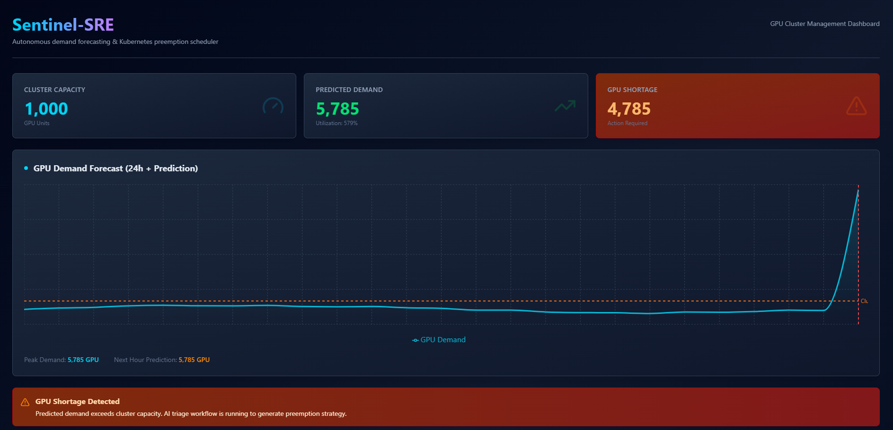
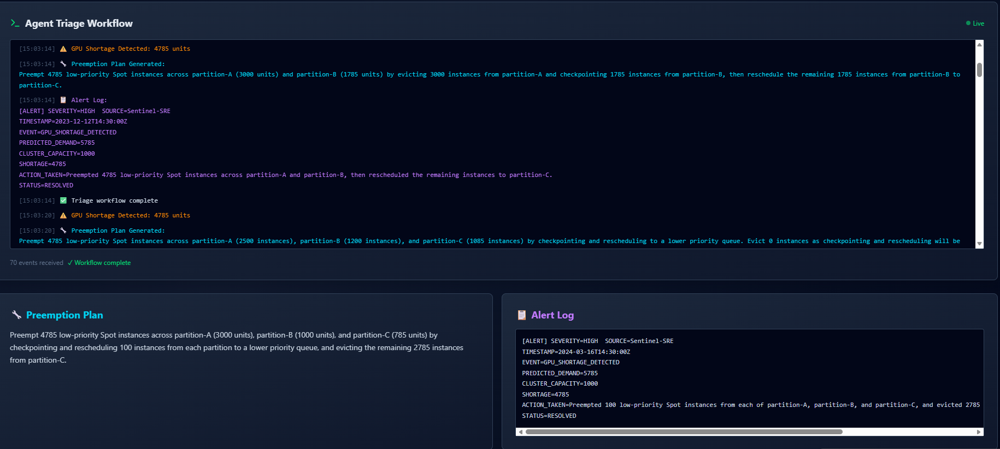

# Sentinel-SRE-Autonomous-Cloud-Resource-Triage

> **An intelligent GPU cluster management system that predicts resource demands and automatically handles resource shortages using AI agents.**

---

## 📖 What is this Project?

Sentinel is an **autonomous resource management system** for GPU clusters in cloud environments. It does three main things:

1. **Predicts GPU Demand** - Uses machine learning (LSTM neural network) to forecast how many GPU resources will be needed in the next hour
2. **Monitors Resources** - Compares predicted demand against available cluster capacity
3. **Handles Shortages Automatically** - When demand exceeds capacity, AI agents generate scheduling plans and alert SRE (Site Reliability Engineering) teams

Think of it as a **smart assistant for GPU cluster management** that watches usage patterns and takes action before problems occur.

---

## 🎯 Key Features

- ⚡ **Real-Time GPU Demand Forecasting** - Predicts resource needs using historical data
- 🤖 **Autonomous Agent System** - AI-powered agents analyze forecasts and generate solutions
- 📊 **Interactive Dashboard** - Modern web UI showing demand trends and metrics
- 🔌 **Live Updates** - WebSocket connections for real-time status streaming
- 📈 **Data-Driven Insights** - Analyzes 24-hour historical patterns for accurate predictions
- 🚨 **Intelligent Alerting** - Generates formatted incident alerts when shortages occur

---

## 🏗️ Architecture Overview

### How It Works (Simple Flow)

```
GPU Usage Data
     ↓
LSTM Forecaster (Predicts next hour's demand)
     ↓
Analyze Results
     ↓
Shortage? NO  → Show dashboard and end
     ↓ YES
     ↓
Scheduler Agent (Plans which jobs to preempt/reschedule)
     ↓
Communicator Agent (Creates alert message)
     ↓
Display Results in Dashboard
```

### Two Main Components

#### **Backend** (Python + FastAPI)
- Runs the forecasting model
- Manages the multi-agent workflow
- Provides REST API for forecasts
- Streams live updates via WebSocket

#### **Frontend** (React + TypeScript + Vite)
- Beautiful, responsive dashboard
- Displays demand charts and metrics
- Shows agent terminal output
- Real-time WebSocket connections

---

## 📁 Project Structure

```
project-root/
│
├── README.md (this file)
│
├── backend/                    # Python backend
│   ├── main.py                 # FastAPI server entry point
│   ├── requirements.txt        # Python dependencies
│   │
│   ├── models/                 # Machine learning models
│   │   ├── forecaster.py       # LSTM prediction engine
│   │   ├── gpu_forecaster.pt   # Trained neural network weights
│   │   └── train.py            # Training script
│   │
│   ├── agents/                 # AI agent workflows
│   │   └── graph.py            # Multi-agent state machine (LangGraph)
│   │
│   ├── api/                    # API endpoints
│   │   ├── routes.py           # REST endpoints
│   │   └── websockets.py       # WebSocket handlers
│   │
│   └── data_prep/              # Data processing
│       └── transformer.py      # Data preprocessing
│
├── frontend/                   # React frontend
│   ├── package.json
│   ├── vite.config.ts         # Build configuration
│   ├── tailwind.config.js      # Styling
│   ├── tsconfig.json           # TypeScript config
│   │
│   ├── public/                 # Static files
│   │
│   └── src/
│       ├── main.tsx            # Entry point
│       ├── App.tsx             # Root component
│       ├── index.css           # Global styles
│       │
│       ├── api/                # API communication
│       │   └── client.ts       # HTTP and WebSocket client
│       │
│       ├── components/         # React components
│       │   ├── Dashboard.tsx    # Main dashboard
│       │   ├── DemandChart.tsx  # Forecast chart
│       │   ├── MetricsRow.tsx   # Metrics display
│       │   └── AgentTerminal.tsx # Agent output viewer
│       │
│       └── types/              # TypeScript definitions
│           └── index.ts        # Shared types
│
└── dataset/                    # Historical data
    ├── raw/                    # Original data files
    │   └── job_info_df.csv
    │
    └── processed/              # Cleaned data for model
        └── hourly_gpu_demand.csv
```

---

## 🚀 Getting Started

### Prerequisites
- Python 3.9+
- Node.js 18+
- pip and npm package managers

### Installation

**1. Clone and navigate to the project**
```bash
cd "d:\My projects\forecasting project\Sentinel-SRE-Autonomous-Cloud-Resource-Triage"
```

**2. Set up Python backend**
```bash
# Create virtual environment
python -m venv .venv

# Activate it (Windows)
.\.venv\Scripts\Activate

# Install dependencies
pip install -r backend/requirements.txt
```

**3. Set up Node.js frontend**
```bash
cd frontend
npm install
cd ..
```

**4. Configure environment (optional)**
Create a `.env` file in the project root if you need to set API keys:
```
GOOGLE_API_KEY=your_key_here
```

### Running the Application

**Start Backend (Terminal 1)**
```bash
python backend/main.py
```
Backend runs on `http://localhost:8000`

**Start Frontend (Terminal 2)**
```bash
cd frontend
npm run dev
```
Frontend runs on `http://localhost:5173` (or shown in terminal)

**Access the Dashboard**
Open your browser and go to the frontend URL (usually `http://localhost:5173`)

---

## 📡 API Endpoints

### REST Endpoints

**Get Forecast**
```
GET /api/forecast
```
Returns:
- Next hour's predicted GPU demand
- Current cluster capacity
- Any resource shortage
- Agent analysis if shortage exists

### WebSocket Connection

**Triage Agent Stream**
```
WS /ws/triage
```
Streams real-time updates from the autonomous agent workflow when processing a shortage situation.

---

## 🖥️ Web UI Preview

### Dashboard Overview


### Metrics & Agent View


## 🧠 Understanding the Components

### 1. **LSTM Forecaster** (`backend/models/forecaster.py`)
- **What it does**: Predicts GPU demand for the next hour
- **How it works**: Takes the last 24 hours of usage data and trains a neural network to predict the pattern
- **Input**: 24-hour GPU demand values
- **Output**: Single prediction for next hour
- **Why LSTM?**: LSTMs are great at learning patterns in time-series data (like hourly trends)

### 2. **Multi-Agent System** (`backend/agents/graph.py`)
The workflow has three stages:

**Stage 1: Analyzer**
- Compares predicted demand vs cluster capacity
- Calculates shortage (if any)

**Stage 2: Scheduler** (runs only if shortage exists)
- Uses Google Gemini LLM to generate a Kubernetes preemption plan
- Suggests which jobs to pause/reschedule
- Goal: Free up GPU resources

**Stage 3: Communicator** (runs only if shortage exists)
- Creates a formatted incident alert
- Notifies the SRE team with action items

### 3. **FastAPI Backend** (`backend/main.py`)
- Runs the entire workflow
- Serves predictions via REST API
- Streams agent progress via WebSocket

### 4. **React Dashboard** (`frontend/src/components/`)
- **Dashboard.tsx**: Main layout and orchestration
- **DemandChart.tsx**: Line chart showing predicted vs actual demand
- **MetricsRow.tsx**: Key numbers and statistics
- **AgentTerminal.tsx**: Shows agent workflow output and decisions

---

## 🔧 Technologies Used

**Backend:**
- `FastAPI` - Modern Python web framework
- `LangGraph` - Multi-agent workflow framework
- `PyTorch` - Deep learning (LSTM model)
- `Pandas` - Data manipulation
- `Uvicorn` - ASGI server
- `Google Generative AI` - LLM for agent decision-making

**Frontend:**
- `React` - UI framework
- `TypeScript` - Type-safe JavaScript
- `Vite` - Lightning-fast build tool
- `Tailwind CSS` - Styling
- `Recharts` - Chart visualization
- `Axios` - HTTP client

---

## 📊 Data Files

- **`dataset/raw/job_info_df.csv`** - Original cluster job logs
- **`dataset/processed/hourly_gpu_demand.csv`** - Cleaned hourly demand data (used by forecaster)

---

## 🎓 How to Extend

### Add a New Agent
Edit `backend/agents/graph.py` to add new workflow nodes.

### Retrain the Forecast Model
Run `backend/models/train.py` with updated data.

### Customize Dashboard
Modify components in `frontend/src/components/`.

### Change API Endpoints
Update `backend/api/routes.py` and `backend/api/websockets.py`.

---

## 📝 Common Tasks

**Check if backend is running:**
```bash
curl http://localhost:8000/api/forecast
```

**View logs:**
- Backend logs print to the terminal running `python backend/main.py`
- Frontend logs appear in browser console (F12)

**Stop services:**
- Backend: `Ctrl+C` in terminal
- Frontend: `Ctrl+C` in terminal

---

## 🤝 Contributing

To contribute improvements:
1. Create a new branch
2. Make your changes
3. Test thoroughly
4. Submit a pull request

---

## 📞 Support

For issues or questions:
- Check terminal logs for error messages
- Verify all dependencies are installed
- Ensure both backend and frontend are running
- Check environment variables in `.env`

---

## 🎯 Project Goals

✅ Autonomously predict GPU resource demand
✅ Prevent cluster resource exhaustion
✅ Reduce SRE manual intervention
✅ Provide real-time visibility into cluster health
✅ Make intelligent scheduling decisions using AI